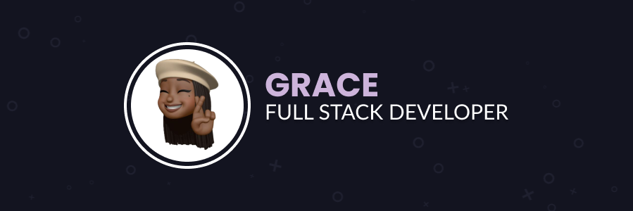

<h1 align="center">Hi 👋, I'm Grace</h1>

<h3 align="left">👩‍💻  About Me</h3>

###

I'm Grace, a passionate Full Stack Developer & Engineer from London   -  📚 I'm currently learning Flutter  - ⚡ In my free time I play sports 

###

<h2>🚀 Languages and Tools I Use</h2>

 

<h3 align="left">🔥   My Stats :</h3>

      
  
  
  

###
 
<h3 align="left">🏆   My Trophies :</h3>

  

###

  

<!--
**RuthlessDove/RuthlessDove** is a ✨ _special_ ✨ repository because its `README.md` (this file) appears on your GitHub profile.

Here are some ideas to get you started:

- 🔭 I’m currently working on ...
- 🌱 I’m currently learning ...
- 👯 I’m looking to collaborate on ...
- 🤔 I’m looking for help with ...
- 💬 Ask me about ...
- 📫 How to reach me: ...
- 😄 Pronouns: ...
- ⚡ Fun fact: ...
-->
